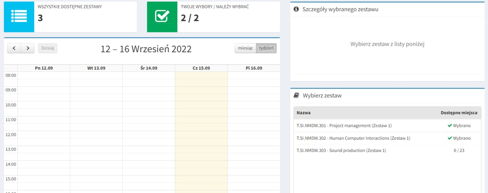
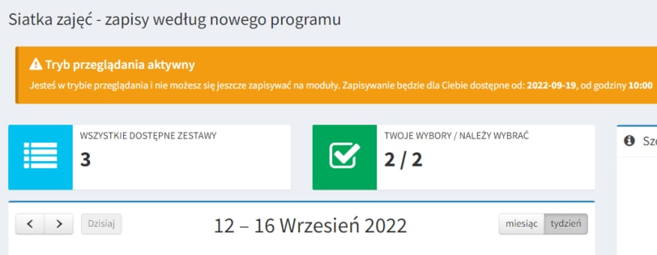
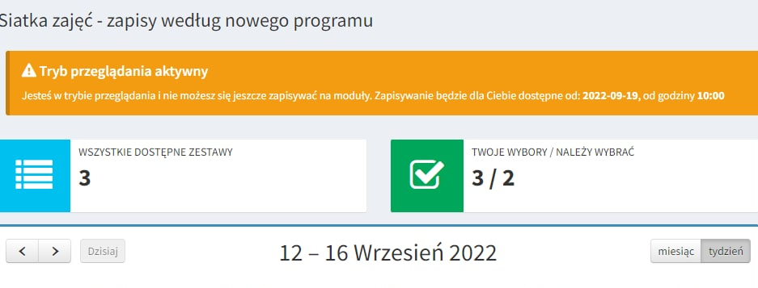
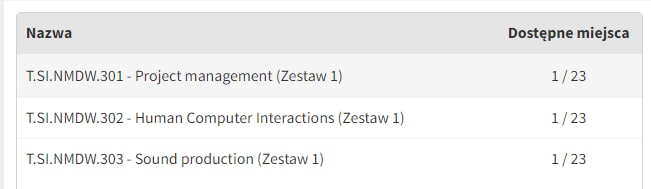
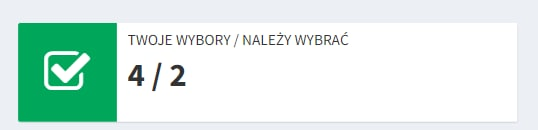

A couple of weeks before the start of the second year of our studies, Collegium Da Vinci provided us with a **new election system for modules**.

While, at the moment, the election itself hasn't started yet, the system was already opened for students to take a look at it and decide which modules to choose.

The lack of modules here is a good topic to consider, but I would like to talk about something else.

Apparently, you could (relatively) easily select anything, even if the election hasn't yet started:

If you already have chosen the maximum amount of modules you are allowed to:

...or if the module is not present in your program. In example, I decided to choose the "Doll animation" module from Polish studies (because, why not):

All you had to do, is to write `onlyBrowsing = 0` in your browser's console. Just one boolean variable on the clientside.

CDV developers violated one of the main security rules: [NEVER TRUST USER INPUT!](https://flylib.com/books/en/1.290.1.90/1/) Don't be like them.

---

**Everything shown in this article has already been fixed and is not a call to action of any kind. Furthermore, the provided article is for informational and educational purpose only. Author takes no responsibility for your activities.**
